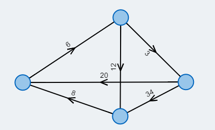
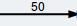
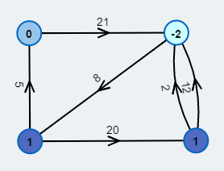
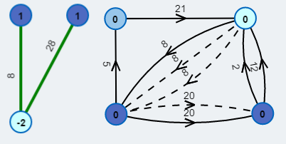
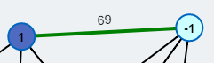
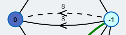
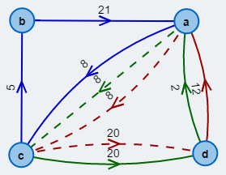

# **[O Problema do Carteiro Chinês](https://pt.wikipedia.org/wiki/Problema_da_inspe%C3%A7%C3%A3o_de_rotas)**

## Introdução

Qual é o percurso fechado de menor custo?

### Legenda

Vértice

Aresta com peso 50

## O Percurso do Carteiro

O **[Problema do Carteiro Chinês](https://pt.wikipedia.org/wiki/Problema_da_inspe%C3%A7%C3%A3o_de_rotas)**, também chamado de problema da rota do carteiro ou problema de inspeção de rotas, é um problema clássico da **[teoria dos grafos](https://pt.wikipedia.org/wiki/Teoria_dos_grafos)**. O objetivo do carteiro é percorrer todas as ruas de uma cidade utilizando o **menor trajeto possível**. Para isso, ele deve passar por cada rua ao menos uma vez e, ao final, retornar ao ponto de partida.

Modelamos esse problema por meio de um **[dígrafo](https://pt.wikipedia.org/wiki/Grafo_orientado)**. As **[arestas](https://pt.wikipedia.org/wiki/Teoria_dos_grafos)** e os **[vértices](https://pt.wikipedia.org/wiki/Teoria_dos_grafos)** representam, respectivamente, ruas e cruzamentos. O comprimento de uma rua é representado pelo **peso** da aresta correspondente. Ao utilizar arestas orientadas, também é possível incorporar ao modelo ruas de sentido único e outras restrições direcionais.

Em termos formais, um **[caminho dirigido](https://pt.wikipedia.org/wiki/Caminho_%28teoria_dos_grafos%29)** é uma sequência de arestas em que o vértice de origem de cada aresta coincide com o vértice terminal da aresta anterior. Um caminho é dito **fechado** quando termina no mesmo vértice em que se inicia.

Um caminho fechado que contém cada aresta do grafo exatamente uma vez é denominado **[circuito euleriano](https://pt.wikipedia.org/wiki/Caminho_euleriano)**. Assim, o problema do carteiro consiste em encontrar, no grafo, um **percurso fechado** tal que todas as arestas sejam percorridas ao menos uma vez e cuja soma dos pesos das arestas percorridas, isto é, o **custo total do percurso**, seja mínima.

### Ideia Principal do Algoritmo
Em primeiro lugar, como vértices sem arestas de entrada nem de saída não influenciam o problema, podemos supor que tais vértices não existem. O problema admite solução se, e somente se, o grafo for **[fortemente conexo](https://pt.wikipedia.org/wiki/Grafo_orientado)**, isto é, se todo vértice puder ser alcançado a partir de qualquer outro, e não contiver **[ciclos](https://pt.wikipedia.org/wiki/Ciclo_%28teoria_de_grafos%29)** de peso negativo, ou seja, circuitos fechados cuja soma dos pesos das arestas seja negativa. Se o grafo não for fortemente conexo, então não pode existir um percurso fechado que cubra todas as arestas; se houver algum ciclo negativo, o **custo ótimo** será ilimitadamente pequeno.

O problema pode ser reduzido à obtenção de um **[circuito euleriano](https://pt.wikipedia.org/wiki/Caminho_euleriano)**. Se tal circuito já existir, então ele será necessariamente ótimo, pois cada aresta será percorrida exatamente uma vez. Caso contrário, uma ou mais arestas precisarão ser percorridas múltiplas vezes. Essa situação pode ser modelada pela adição de **arestas extras** ao grafo, representando as arestas que serão reutilizadas, mantendo-se os mesmos pesos das arestas originais. Desse modo, o custo do percurso fechado no qual algumas arestas são repetidas coincide com o custo do circuito euleriano correspondente no novo grafo. Resta, portanto, determinar quais arestas deverão ser repetidas na **solução ótima**.

O número de arestas que chegam a um vértice é chamado **[grau de entrada](https://pt.wikipedia.org/wiki/Grafo_orientado)**, enquanto o número de arestas que saem dele é chamado **[grau de saída](https://pt.wikipedia.org/wiki/Grafo_orientado)**. Um teorema clássico da teoria dos grafos afirma que um dígrafo possui **[circuito euleriano](https://pt.wikipedia.org/wiki/Caminho_euleriano)** se, e somente se, os graus de entrada e de saída **coincidirem** em todos os seus vértices. Portanto, basta acrescentar **caminhos adicionais** ao grafo de modo que, após sua inserção, os graus de entrada e de saída de todos os vértices se tornem iguais. A soma dos pesos das arestas desses caminhos adicionais deve ser mínima. A determinação de quais caminhos devem ser acrescentados será feita na fase de **[emparelhamento](https://pt.wikipedia.org/wiki/Acoplamento_%28teoria_dos_grafos%29)** do algoritmo.

Depois de garantir que o grafo contenha um **[circuito euleriano](https://pt.wikipedia.org/wiki/Caminho_euleriano)**, ainda é necessário encontrá-lo. Para isso, pode-se empregar qualquer algoritmo adequado, como o **[método de Hierholzer](https://de.wikipedia.org/wiki/Algorithmus_von_Hierholzer)**. O custo do percurso ótimo será, então, exatamente a soma dos pesos de todas as arestas do circuito euleriano obtido.

### Caminhos Mínimos
Precisamos inserir caminhos que partam dos vértices com deficiência de grau de saída em direção aos vértices com deficiência de grau de entrada. Como desejamos minimizar o custo total, esses caminhos devem ser **[caminhos mínimos](https://pt.wikipedia.org/wiki/Caminho_%28teoria_dos_grafos%29)**. Uma forma de determiná-los é por meio do **[algoritmo de Floyd-Warshall](https://pt.wikipedia.org/wiki/Algoritmo_de_Floyd-Warshall)**. Esse algoritmo é particularmente útil neste contexto, pois calcula simultaneamente os caminhos mínimos entre todos os pares de vértices. Posteriormente, os custos desses caminhos mínimos serão utilizados na fase de **[emparelhamento](https://pt.wikipedia.org/wiki/Acoplamento_%28teoria_dos_grafos%29)** para determinar o **conjunto ótimo** de caminhos a ser acrescentado.

### Emparelhamento
Ao inserir caminhos adicionais, buscamos equilibrar os **[graus de entrada](https://pt.wikipedia.org/wiki/Grafo_orientado)** e de **[saída](https://pt.wikipedia.org/wiki/Grafo_orientado)** de todos os vértices do grafo, pois somente nessa condição existirá um **[circuito euleriano](https://pt.wikipedia.org/wiki/Caminho_euleriano)**. Seja `delta(v)` a diferença entre o grau de saída e o grau de entrada do vértice `v`. Chamamos de **desbalanceados** os vértices `v` para os quais `delta(v) != 0`. Para determinar quais caminhos devem ser adicionados, precisamos estabelecer um **[emparelhamento](https://pt.wikipedia.org/wiki/Acoplamento_%28teoria_dos_grafos%29)** entre vértices com `delta(v) < 0` e vértices com `delta(v) > 0`. O valor de `|delta(v)|` indica quantos novos caminhos devem começar ou terminar em `v`. Ao acrescentar um caminho, `delta` aumenta em 1 no vértice de origem `o` e diminui em 1 no vértice de destino `d`.

O peso total dos caminhos adicionais deve ser minimizado. Para isso, podemos construir um novo **[grafo bipartido](https://pt.wikipedia.org/wiki/Grafo_bipartido)** contendo todos os vértices desbalanceados. Particionamos esses vértices em dois conjuntos: aqueles com `delta(v) < 0` e aqueles com `delta(v) > 0`. O valor de `|delta(v)|` determina quantas cópias do vértice `v` aparecerão nesse **grafo bipartido auxiliar**. Por exemplo, um vértice `v` com `|delta(v)| = 3` terá exatamente três cópias no **grafo de emparelhamento**. Por razões de legibilidade, na visualização do algoritmo cada vértice desbalanceado pode aparecer apenas uma vez. Assim, um mesmo vértice na representação visual do grafo de emparelhamento pode estar incidente a mais de uma **aresta de emparelhamento**, conforme determinado por `|delta(v)|`.

O peso de uma aresta no grafo de emparelhamento representa o comprimento do **[caminho mínimo](https://pt.wikipedia.org/wiki/Caminho_%28teoria_dos_grafos%29)** entre seu vértice de origem, com `delta(v) < 0`, e seu vértice de destino, com `delta(v) > 0`. A soma dos graus de entrada é sempre igual à soma dos graus de saída em qualquer grafo; consequentemente, o mesmo vale para a soma dos valores positivos e negativos de `delta`. Dessa forma, obtemos um **[grafo bipartido completo](https://pt.wikipedia.org/wiki/Grafo_bipartido_completo)**. Em seguida, podemos aplicar um **algoritmo de emparelhamento ótimo com pesos**, como o **[método húngaro](https://es.wikipedia.org/wiki/Algoritmo_h%C3%BAngaro)**. Isso produzirá o **emparelhamento ótimo** e permitirá adicionar os caminhos correspondentes. As arestas desses caminhos representam precisamente aquelas que aparecerão múltiplas vezes no **percurso fechado ótimo**.

### Circuito Euleriano
Após a adição desses caminhos suplementares, os **[graus de entrada](https://pt.wikipedia.org/wiki/Grafo_orientado)** e de **[saída](https://pt.wikipedia.org/wiki/Grafo_orientado)** de todos os vértices do grafo estarão equilibrados. Nesse momento, necessariamente existirá um **[circuito euleriano](https://pt.wikipedia.org/wiki/Caminho_euleriano)**, o qual pode ser encontrado pelo **[método de Hierholzer](https://de.wikipedia.org/wiki/Algorithmus_von_Hierholzer)**. O custo do **percurso fechado ótimo** será dado pela soma dos pesos de todas as arestas desse circuito euleriano.

## Descrição do Algoritmo

O **grafo inicial** apresenta, em cada vértice, a diferença entre seu grau de saída e seu grau de entrada. Os vértices para os quais essa diferença é distinta de zero são chamados de **desbalanceados**.

Esta figura apresenta o **grafo bipartido de emparelhamento** construído a partir dos vértices desbalanceados. É nesse grafo auxiliar que se determina entre quais pares de vértices devem ser inseridos novos caminhos. A representação à direita mostra o grafo resultante após a inserção desses caminhos adicionais.

Uma **aresta de emparelhamento** indica um pareamento escolhido no grafo auxiliar. Esse pareamento determina onde novos caminhos devem ser inseridos no grafo original.

Uma **nova aresta inserida** representa, no modelo expandido, a reutilização de uma aresta ou de um caminho no percurso ótimo. A linha pontilhada indica arestas que são percorridas múltiplas vezes.

O **circuito euleriano** obtido após o balanceamento dos graus fornece o percurso fechado procurado. As diferentes cores destacam os subtours identificados durante a execução do método de Hierholzer.
