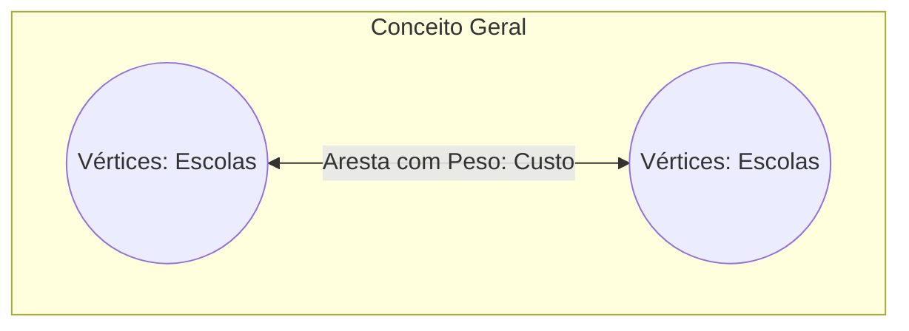
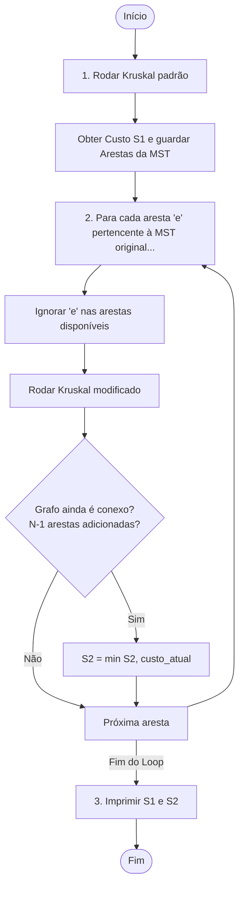

# Planejamento e Tutorial Didático: Segundo Menor Caminho e Árvore Geradora Mínima (SMST)

**Problema:** UVA 10600 - ACM Contest and Blackout
**Equipe:** 3 Integrantes
**Linguagem:** Python (Inspirado em `algs4-py`)

---

1. 1. Visão Geral do Problema e Modelagem[](https://)

O objetivo do problema é encontrar os dois planos de conexão mais baratos em um grafo valorado não-direcionado.

- O **primeiro plano mais barato** ($S_1$) é a **Árvore Geradora Mínima (MST)** do grafo.
- O **segundo plano mais barato** ($S_2$) é a **Segunda Árvore Geradora Mínima (SMST)** do grafo.

### Modelagem matemática como Grafo:

- **Vértices ($V$):** As escolas da cidade (enumeradas de $1$ a $N$).
- **Arestas ($E$):** As conexões possíveis entre as escolas.
- **Pesos ($W$):** O custo $C_i$ de cada conexão.



---

## 2. A Estratégia do Algoritmo

Para resolver o problema de forma eficiente e simples (dado que $N < 100$), utilizaremos a teoria de grafos relacionada a árvores geradoras.

### Como encontrar a MST ($S_1$)?

Usaremos o **Algoritmo de Kruskal**, que funciona de maneira gulosa (greedy):

1. Ordenamos todas as arestas do grafo em ordem crescente de peso.
2. Inicializamos uma estrutura de **Union-Find (DSU)** para gerenciar as componentes conexas e evitar ciclos.
3. Iteramos pelas arestas ordenadas. Para cada aresta entre $u$ e $v$:
   - Se $u$ e $v$ não estão na mesma componente conexa (ou seja, não formam ciclo), adicionamos a aresta à MST e unimos suas componentes no Union-Find.
   - Caso contrário, ignoramos a aresta.
4. Paramos quando tivermos exatamente $N-1$ arestas na MST. O custo total acumulado será $S_1$.

### Como encontrar a Segunda MST ($S_2$)?

Existe um teorema importante sobre a Segunda MST:

> **Teorema:** A Segunda MST difere da MST principal por pelo menos uma aresta. Ou seja, ela é obtida removendo uma das arestas que pertencem à MST original e substituindo-a por outra aresta do grafo que não cause ciclos.

Dado que $N < 100$, a nossa MST original terá no máximo $N-1 < 99$ arestas. A estratégia mais simples e robusta é:

1. Encontrar a MST original e **guardar quais arestas fazem parte dela**.
2. Para cada aresta $e$ que pertence à MST original:
   - Removemos temporariamente a aresta $e$ do grafo (ou simplesmente a ignoramos na busca).
   - Rodamos o algoritmo de Kruskal novamente nas arestas restantes.
   - Se conseguirmos formar uma árvore geradora válida (com $N-1$ arestas), calculamos o seu custo $S_{temp}$.
   - O custo da Segunda MST ($S_2$) será o menor valor de $S_{temp}$ encontrado entre todas as tentativas de remoção.



> [!TIP]
> **Otimização Importante:** Você só precisa ordenar a lista de arestas **uma única vez** no início do programa. Nas execuções subsequentes do Kruskal (para achar $S_2$), você pode simplesmente iterar sobre a lista já ordenada, apenas ignorando a aresta que foi removida. Isso reduz a complexidade total!

---

## 3. Divisão de Trabalho da Equipe (3 Integrantes)

Para que todos trabalhem em paralelo de forma eficiente e aprendam os conceitos, a divisão de tarefas sugerida é:

```
                  ┌─────────────────────────────────────────┐
                  │          Alinhamento Inicial            │
                  │   Definição de Interfaces / Contratos   │
                  └────────────────────┬────────────────────┘
                                       │
         ┌─────────────────────────────┼─────────────────────────────┐
         ▼                             ▼                             ▼
┌──────────────────┐          ┌──────────────────┐          ┌──────────────────┐
│   Integrante 1   │          │   Integrante 2   │          │   Integrante 3   │
│   Estrutura de   │          │   Algoritmo de   │          │  Lógica da SMST  │
│  Dados & Entrada │          │  Kruskal Padrão  │          │   & Integração   │
└──────────────────┘          └──────────────────┘          └──────────────────┘
```


| Integrante       | Responsabilidade Principal                                    | Arquivos / Funções a Focar                                                                                       | Conceito Chave                                                                               |
| :--------------- | :------------------------------------------------------------ | :----------------------------------------------------------------------------------------------------------------- | :------------------------------------------------------------------------------------------- |
| **Integrante 1** | Estruturas de Dados (`Edge`, `UF`) e Parser de Entrada.       | Classe`Edge`, Classe `UF` (Union-Find), leitura de dados do terminal (`sys.stdin`).                                | Estruturas de Dados do`algs4`, representação de grafos, compressão de caminhos.           |
| **Integrante 2** | Algoritmo de Kruskal e busca da MST.                          | Função`kruskal(...)` que recebe a lista de arestas e retorna o custo da MST e a lista de arestas que a compõem. | Algoritmos Gulosos (Greedy), ordenação de objetos, detecção de ciclos com Union-Find.    |
| **Integrante 3** | Algoritmo da Segunda MST (SMST), Integração Geral e Testes. | Loop principal, tratamento de múltiplos casos de teste ($T$) e comparação de resultados.                        | Manipulação de conjuntos de arestas, busca exaustiva por exclusão, teste de casos limite. |

---

## 4. Guia de Implementação Passo a Passo (Sem Spoilers de Código)

Nesta seção, cada integrante tem um guia didático para construir sua parte, utilizando a filosofia do livro *Algorithms, 4th Edition (algs4)*.

### 👤 Integrante 1: Estruturas de Dados e Entrada

Você deve focar em criar a base sobre a qual o algoritmo vai rodar.

#### Passo 1: A Classe `Edge` (Aresta)

Baseado no `Edge.java` do `algs4`, sua classe em Python deve encapsular os dados de uma aresta:

- **Construtor:** Deve aceitar dois vértices (por exemplo, `v` e `w`) e o peso `weight` da aresta.
- **Métodos didáticos:**
  - `either()`: Retorna um dos vértices da aresta.
  - `other(vertex)`: Retorna o outro vértice (diferente do que foi passado como argumento).
  - `weight()`: Retorna o peso da aresta.
- **Comparação:** Para que a ordenação nativa do Python funcione (`list.sort()`), você deve implementar o método especial `__lt__(self, other)` na classe `Edge`. Ele deve comparar o peso de duas arestas e retornar `True` se a atual for menor que a outra.

#### Passo 2: A Classe `UF` (Union-Find / Disjoint Set Union)

Baseado no `UF.java` do `algs4`, implemente o algoritmo Quick-Union com **Compressão de Caminhos por Divisão** (path compression) e **União por Rank** (union by rank/size).

- **Construtor:** Inicializa um vetor `parent` onde cada vértice é o seu próprio pai (`parent[i] = i`) e um vetor `rank` inicializado com zeros.
- **Método `find(p)`:** Encontra o representante/líder do conjunto que contém `p`. Use a compressão de caminho para fazer com que os nós apontem diretamente para o avô, reduzindo a altura da árvore.
- **Método `union(p, q)`:** Une os conjuntos de `p` e `q`. Use o vetor de `rank` para anexar a árvore menor sob a raiz da árvore maior, mantendo a estrutura balanceada.
- **Método `connected(p, q)`:** Retorna se `p` e `q` pertencem ao mesmo conjunto (ou seja, `find(p) == find(q)`).

> [!WARNING]
> Os vértices das escolas no problema variam de $1$ a $N$. Lembre-se de ajustar o tamanho do vetor do Union-Find para suportar o índice $N$ (usando tamanho $N+1$).

---

### 👤 Integrante 2: O Algoritmo de Kruskal

Você usará as estruturas feitas pelo Integrante 1 para encontrar a MST original.

#### Passo 1: Definir a assinatura da função Kruskal

A sua função `kruskal` precisa ser flexível, pois ela será usada tanto para calcular a MST original quanto para calcular as sub-MSTs (onde ignoramos uma das arestas).
Uma boa assinatura seria:

```python
def kruskal(n, edges, edge_to_skip=None):
    # n: número de vértices (escolas)
    # edges: lista contendo objetos da classe Edge (deve estar pré-ordenada)
    # edge_to_skip: objeto Edge que deve ser ignorado durante este cálculo
```

#### Passo 2: Lógica Interna do Kruskal

1. Inicialize uma nova instância do `UF` com tamanho adequado.
2. Crie uma lista vazia `mst_edges` para guardar as arestas escolhidas e um acumulador `mst_weight = 0`.
3. Iterar sobre cada aresta na lista `edges`:
   - **Caso Especial:** Se a aresta atual for idêntica a `edge_to_skip`, use `continue` para ignorá-la. *(Dica: você pode comparar os objetos ou seus identificadores/vértices).*
   - Obtenha os vértices `v` e `w` da aresta atual.
   - Verifique usando a estrutura Union-Find (`uf.connected(v, w)`) se eles formam ciclo.
   - Se não formarem ciclo:
     - Use `uf.union(v, w)` para conectar os conjuntos.
     - Adicione o peso da aresta ao `mst_weight`.
     - Insira a aresta na lista `mst_edges`.
4. **Verificação de Conectividade:** Após processar as arestas, verifique se a quantidade de arestas em `mst_edges` é igual a $N - 1$.
   - Se for menor que $N - 1$, significa que o grafo ficou desconectado (isso acontece quando removemos uma aresta essencial que ligava duas partes do grafo). Nesse caso, a MST não é válida. Você pode retornar um peso infinito (ex: `float('inf')`) e uma lista vazia.
   - Caso contrário, retorne `(mst_weight, mst_edges)`.

---

### 👤 Integrante 3: A Lógica da Segunda MST e Integração Geral

Você é o responsável por orquestrar a execução, gerenciar a entrada/saída e implementar o loop de exclusão de arestas.

#### Passo 1: Loop de Casos de Teste e Parser de Entrada

O problema especifica que a entrada começa com um inteiro $T$ (número de casos de teste).
Para cada caso de teste:

1. Leia a linha contendo $N$ (número de escolas) e $M$ (número de conexões possíveis).
2. Leia as próximas $M$ linhas, onde cada linha contém $A_i, B_i, C_i$.
3. Para cada conexão, crie um objeto `Edge(Ai, Bi, Ci)` e adicione-o a uma lista chamada `edges`.

#### Passo 2: Encontrar $S_1$ (MST Original)

1. Ordene a lista `edges` usando a função padrão de ordenação do Python. Como o Integrante 1 implementou `__lt__`, o Python ordenará as arestas de forma crescente de peso automaticamente.
2. Chame a função do Integrante 2: `s1, mst_original_edges = kruskal(N, edges)`.
3. Agora você tem o custo da MST original ($S_1$) e a lista das arestas que a compõem.

#### Passo 3: Encontrar $S_2$ (Segunda MST)

1. Inicialize `s2` com um valor muito grande (ex: `float('inf')`).
2. Iterar sobre cada aresta `e` na lista `mst_original_edges`:
   - Chame a função Kruskal pulando a aresta `e`: `s_temp, _ = kruskal(N, edges, edge_to_skip=e)`.
   - Atualize `s2 = min(s2, s_temp)`.
3. Ao final do loop, o valor em `s2` será o custo da Segunda MST.
4. Imprima o resultado no formato esperado pelo problema: `f"{s1} {s2}"`.

---

## 5. Plano de Testes e Casos Limite

Antes de submeter o código no UVA Online Judge, vocês devem garantir que a solução passe em casos de teste locais.

### Caso de Teste do Enunciado (Sample Input)

Crie um arquivo txt (ex: `dados/entradas_do_problema.txt`) com a entrada fornecida no PDF do problema:

```text
2
5 8
1 3 75
3 4 51
2 4 19
3 2 95
2 5 42
5 4 31
1 2 9
3 5 66
9 14
1 2 4
1 8 8
2 8 11
3 2 8
8 9 7
8 7 1
7 9 6
9 3 2
3 4 7
3 6 4
7 6 2
4 6 14
4 5 9
5 6 10
```

E verifiquem se a saída gerada pelo programa de vocês é exatamente:

```text
110 121
37 37
```

### Casos de Teste Especiais para Validar na Mão:

- **Grafo com Múltiplas MSTs de mesmo custo:** O que acontece se o grafo for um quadrado de lados iguais? (ex: 4 vértices, 4 arestas de peso 2). O programa deve retornar $S_1 = 6$ e $S_2 = 6$.
- **Pontes (Arestas de Corte):** Se o grafo tiver uma aresta cuja remoção desconecta o grafo. O Kruskal modificado deve detectar que a árvore geradora não pôde ser completada (menos de $N-1$ arestas) e retornar infinito para aquela tentativa específica, sem quebrar o programa.
- **Grafos Densos vs Esparsos:** Certifiquem-se de que a ordenação seja feita apenas uma vez para não estourar o tempo se $M$ for grande.

---

## 6. Preparação para a Apresentação (5 minutos)

A apresentação deve focar na **modelagem** e na **lógica matemática/algorítmica**, e não na leitura de código linha por linha. Aqui está uma sugestão de roteiro para os slides (que devem estar em um PDF no repositório):


|    Slide    | Conteúdo Sugerido                                                                                                                                                                                                                        | Quem Apresenta |
| :---------: | :---------------------------------------------------------------------------------------------------------------------------------------------------------------------------------------------------------------------------------------- | :------------- |
| **Slide 1** | **Título do Trabalho e Apresentação**<br>- Nome do Problema (UVA 10600 - ACM Contest and Blackout).<br>- Nome dos integrantes da equipe.                                                                                               | Integrante 1   |
| **Slide 2** | **Modelagem como Grafo**<br>- Como o problema real se mapeia para vértices (escolas), arestas (cabos) e pesos (custos).<br>- O que representa a solução do problema na teoria dos grafos (MST e SMST).                                 | Integrante 1   |
| **Slide 3** | **O Algoritmo de Kruskal e Union-Find**<br>- Breve explicação de como o Kruskal constrói a MST usando a estratégia gulosa.<br>- O papel fundamental do Union-Find na detecção rápida de ciclos ($O(\alpha(N))$).                   | Integrante 2   |
| **Slide 4** | **A Estratégia para Encontrar a Segunda MST**<br>- Explicação do Teorema da diferença de arestas.<br>- Como a remoção exaustiva das arestas da MST nos permite achar a segunda melhor opção de forma eficiente.                   | Integrante 3   |
| **Slide 5** | **Análise de Complexidade e Conclusão**<br>- Complexidade de tempo: $O(M \log M + N \cdot M \cdot \alpha(N))$.<br>- Discussão sobre casos limite (ex: arestas pontes).<br>- Demonstração rápida do print de Accepted na plataforma. | Integrante 3   |

---

## 7. Próximos Passos Recomendados

1. **Reunião de Alinhamento:** Juntem-se para criar a estrutura de arquivos no repositório exatamente como o professor pediu (`src/main.py`, `dados/`, `evidencias/`, `apresentacao/`).
2. **Definição de Interfaces:** Definam juntos as assinaturas exatas de classes e métodos antes de começar a codificar, para que a integração seja o mais suave possível.
3. **Desenvolvimento Local:** Escrevam suas partes nos arquivos separados ou no mesmo arquivo, e usem redirecionamento de entrada no terminal para testar:
   ```bash
   python src/main.py < dados/entradas_do_problema.txt
   ```
4. **Submissão:** Submetam no UVA Online Judge e capturem o print com o status **Accepted** para anexar ao repositório.
5. **Slides:** Elaborem a apresentação de 5 slides focando no visual claro e didático.
