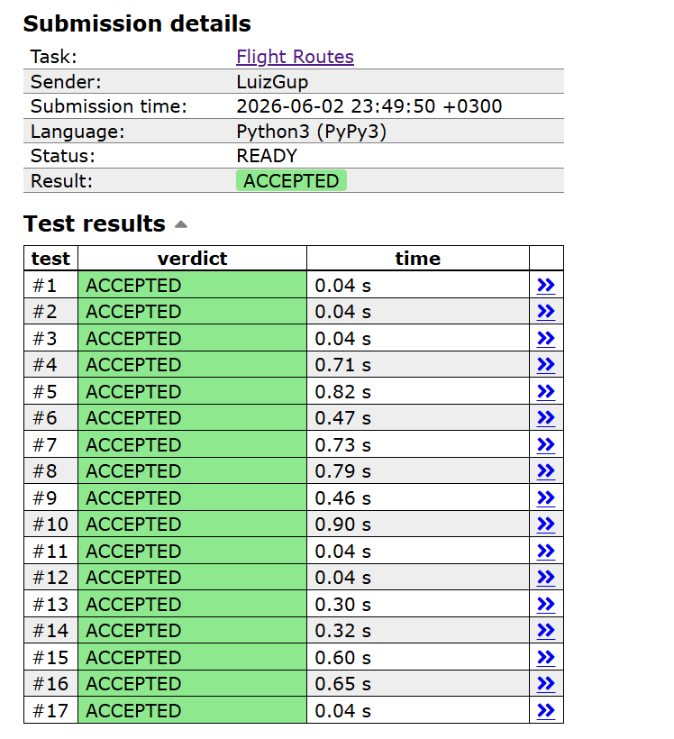

# CSES 1196 — Flight Routes (K Menores Rotas)

## 📋 Informações Gerais

| Item | Detalhe |
|:-----|:--------|
| **Problema** | CSES 1196 — Flight Routes |
| **Link** | https://cses.fi/problemset/task/1196 |
| **Grupo** | J |
| **Linguagem** | Python 3 |

### Integrantes

- João Isaías — 2310283
- Luiz Carlos — 2410410
- Ricardo André — 2417200

---

## ▶️ Como Executar

### Pré-requisitos

- Python 3.7 ou superior

### Execução com entrada pelo terminal

```bash
# Windows (PowerShell):
Get-Content dados\entradas_do_problema.txt | python src\main.py

# Windows (CMD):
python src\main.py < dados\entradas_do_problema.txt

# Linux / Mac:
python3 src/main.py < dados/entradas_do_problema.txt
```

### Exemplo

**Entrada** (`dados/entradas_do_problema.txt`):
```
4 6 3
1 2 1
1 3 3
2 3 2
2 4 6
3 2 8
3 4 1
```

**Saída esperada:**
```
4 4 7
```

---

## 🧩 Modelagem do Problema

O problema pede os **k menores custos de rota** entre a cidade 1 (Syrjälä) e a cidade n (Metsälä) em uma rede de voos. Rotas podem revisitar cidades e rotas com mesmo custo são contadas separadamente.

### Representação como Grafo

| Elemento | Representação |
|:---------|:--------------|
| **Vértices** | Cidades (numeradas de 1 a n) |
| **Arestas** | Voos disponíveis (direcionadas) |
| **Pesos** | Preço de cada voo (inteiro positivo) |
| **Origem** | Cidade 1 |
| **Destino** | Cidade n |

O grafo é **direcionado** e **ponderado**, representado internamente por uma **lista de adjacência** onde cada posição `adj[v]` contém os objetos `DirectedEdge` que representam os voos que saem da cidade `v`.

A classe `DirectedEdge` encapsula cada aresta com `from_vertex()`, `to_vertex()` e `get_weight()`, seguindo a interface do `DirectedEdge` do livro *Algorithms, 4th Edition* (algs4).

---

## ⚙️ Algoritmo Utilizado

### Dijkstra Modificado para K Menores Caminhos

Como todos os pesos são **estritamente positivos** (1 ≤ c ≤ 10⁹), o algoritmo de Dijkstra é aplicável.

A variação utilizada difere do Dijkstra clássico em um ponto fundamental:

| Aspecto | Dijkstra Clássico | Dijkstra para K Caminhos |
|:--------|:-------------------|:--------------------------|
| Extrações por vértice | 1 vez | Até **k** vezes |
| Vetor `distTo[]` | Sim, atualizado via relaxamento | Não utilizado |
| Controle | `visited[]` ou `distTo[]` | Contador `count[v]` |
| Resultado | Menor distância para cada vértice | k menores custos até o destino n |

### Funcionamento

1. **Inicialização:** vetor `count[v] = 0` para todo vértice; fila de prioridade mínima com `(0, 1)`.
2. **Loop principal:** enquanto a fila não está vazia e temos menos de k resultados:
   - Extrai `(dist, u)` com menor custo da fila.
   - Incrementa `count[u]`. Se `count[u] > k`, ignora (poda).
   - Se `u == n` (destino), registra `dist` como um dos k menores custos.
   - **Relaxamento:** para cada aresta `u → v` com peso `w`, se `count[v] < k`, insere `(dist + w, v)` na fila.
3. **Saída:** imprime os k custos encontrados.

**Por que funciona?** A fila de prioridade mínima garante que os custos são extraídos em ordem crescente. A j-ésima extração do destino n corresponde ao j-ésimo menor custo de rota.

### Estrutura de arquivos

| Arquivo | Responsabilidade |
|:--------|:-----------------|
| `src/directed_edge.py` | Classe `DirectedEdge` — aresta direcionada com peso |
| `src/graph.py` | Parser de entrada + construção da lista de adjacência |
| `src/dijkstra_k.py` | Dijkstra modificado para k menores caminhos |
| `src/main.py` | Integração: leitura → algoritmo → saída |

---

## 📐 Análise de Complexidade

### Tempo: O(k · m · log(k · m))

- Cada vértice pode ser extraído da fila até **k** vezes.
- Cada extração processa as arestas adjacentes e insere na fila.
- Operações de `heappush` e `heappop` custam O(log(tamanho da fila)).
- No pior caso, a fila pode ter até O(k · m) entradas.

### Espaço: O(n + m + k · m)

- Lista de adjacência: O(n + m).
- Fila de prioridade: até O(k · m) entradas no pior caso.
- Vetor `count[]`: O(n).

### Viabilidade

Com as restrições do problema (n ≤ 10⁵, m ≤ 2 × 10⁵, k ≤ 10), o algoritmo executa dentro do limite de 1 segundo e 512 MB de memória.

---

## ✅ Evidência de Submissão

<!-- ⚠️ SUBSTITUIR pela imagem real após submissão no CSES -->


---

## 📚 Referências

- SEDGEWICK, R.; WAYNE, K. *Algorithms, 4th Edition*. Addison-Wesley, 2011.
- Repositório `algs4-py`: implementação de referência em Python.
- CP-Algorithms — Dijkstra: https://cp-algorithms.com/graph/dijkstra.html
- CSES Problem Set: https://cses.fi/problemset/task/1196
