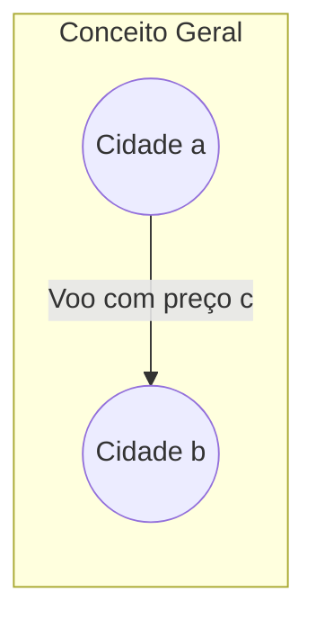
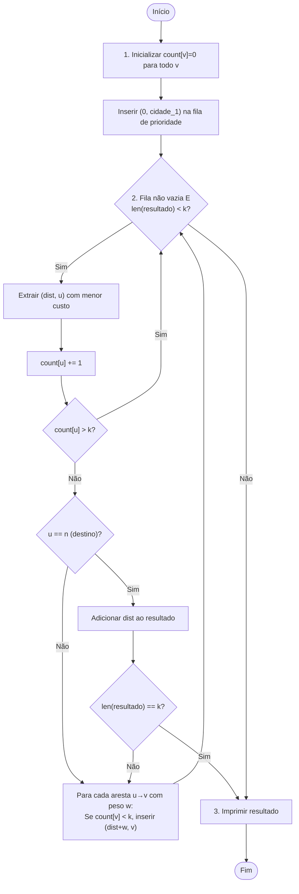

# Planejamento e Tutorial Didático: K Menores Rotas (K Shortest Paths)

**Problema:** CSES 1196 - Flight Routes
**Equipe:** 3 Integrantes
**Linguagem:** Python (Inspirado em `algs4-py`)

---

## 1. Visão Geral do Problema e Modelagem

O objetivo do problema é encontrar os **$k$ menores custos de rotas** entre a cidade $1$ (Syrjälä) e a cidade $n$ (Metsälä) em um grafo direcionado com pesos positivos.

- Uma rota pode **revisitar cidades** (não é caminho simples).
- Rotas com o **mesmo custo** devem ser contadas separadamente.
- É garantido que existem ao menos $k$ rotas distintas de $1$ a $n$.

### Modelagem matemática como Grafo:

- **Vértices ($V$):** As cidades (enumeradas de $1$ a $n$).
- **Arestas Direcionadas ($E$):** Os voos disponíveis entre cidades.
- **Pesos ($W$):** O preço $c_i$ de cada voo.



### Diferença fundamental em relação ao T1:

| Aspecto              | T1 (MST / SMST)                      | T2 (K Shortest Paths)                     |
| :------------------- | :------------------------------------ | :---------------------------------------- |
| **Tipo de grafo**    | Não-direcionado                       | Direcionado                               |
| **Algoritmo base**   | Kruskal (Árvore Geradora Mínima)      | Dijkstra (Caminhos Mínimos)               |
| **Estrutura chave**  | Union-Find (DSU)                      | Fila de Prioridade (Heap / `heapq`)       |
| **Objetivo**         | Conectar todos os vértices com custo mínimo | Encontrar as $k$ menores distâncias de $1$ a $n$ |
| **Revisita vértices**| Não se aplica                         | Sim, cidades podem ser revisitadas        |

---

## 2. A Estratégia do Algoritmo

### Por que Dijkstra é aplicável?

Todos os pesos das arestas são **estritamente positivos** ($1 \le c \le 10^9$), satisfazendo a pré-condição do algoritmo de Dijkstra. Isso garante que, uma vez que um vértice é processado com uma determinada distância, essa distância é ótima para aquela "visita".

### Dijkstra Modificado para K Menores Caminhos

O Dijkstra clássico encontra **uma única** menor distância para cada vértice. Para encontrar os **$k$ menores caminhos até o destino $n$**, usamos uma variação elegante:

> **Ideia Central:** Em vez de manter apenas a menor distância para cada vértice, permitimos que cada vértice seja **processado (extraído da fila) até $k$ vezes**. Cada vez que o vértice destino $n$ é extraído da fila de prioridade, registramos o custo como um dos $k$ menores caminhos.

#### Passos do Algoritmo:

1. **Inicialização:**
   - Criar um vetor `count[v]` para cada vértice, inicializado com $0$. Ele conta quantas vezes o vértice $v$ foi extraído (relaxado) da fila de prioridade.
   - Inserir a tupla $(0, 1)$ na fila de prioridade mínima (custo $0$ para chegar à cidade $1$).
   - Criar uma lista `resultado` para armazenar os $k$ menores custos até a cidade $n$.

2. **Loop Principal (while fila não vazia e `len(resultado) < k`):**
   - Extrair o par $(dist, u)$ com **menor custo** da fila.
   - Incrementar `count[u]`.
   - Se `count[u] > k`, ignorar (já temos $k$ caminhos passando por $u$; `continue`).
   - Se `u == n` (destino), adicionar `dist` à lista `resultado`.
   - Para cada aresta $(u \to v)$ com peso $w$:
     - Se `count[v] < k`, inserir $(dist + w, v)$ na fila.

3. **Saída:**
   - Imprimir os $k$ valores da lista `resultado` separados por espaço.



> [!TIP]
> **Por que funciona?** A fila de prioridade mínima garante que os custos são extraídos em ordem crescente. Portanto, a $j$-ésima vez que o vértice $n$ é extraído da fila corresponde ao $j$-ésimo menor custo de rota de $1$ a $n$. Como limitamos cada vértice a no máximo $k$ extrações, a complexidade é controlada.

> [!WARNING]
> **Diferença do Dijkstra clássico:** No Dijkstra padrão, cada vértice é processado **uma única vez** e usa-se um vetor `dist[]` que é atualizado. Aqui, **não usamos** um vetor de distâncias mínimas clássico — permitimos múltiplas inserções do mesmo vértice na fila (lazy deletion), e controlamos pelo contador `count[v]`.

---

## 3. Referências do `algs4-py`

As seguintes classes do repositório `algs4-py` servem como **referência conceitual e estrutural**:

| Classe `algs4-py`     | Conceito                                                          | Uso no T2                                                        |
| :-------------------- | :---------------------------------------------------------------- | :--------------------------------------------------------------- |
| `DirectedEdge`        | Aresta direcionada com `From()`, `To()` e `weight`                | Inspiração para a classe `DirectedEdge` do nosso projeto         |
| `EdgeWeightedDigraph` | Grafo direcionado ponderado com lista de adjacência (`adj[]`)     | Inspiração para a representação do grafo via lista de adjacência  |
| `DijkstraSP`          | Dijkstra clássico com `IndexMinPQ`, `relax()`, `distTo[]`        | Base conceitual; adaptaremos para suportar $k$ extrações         |
| `IndexMinPQ`          | Fila de prioridade indexada com `swim()`, `sink()`, `del_min()`  | Conceito de heap; usaremos `heapq` do Python por praticidade     |

> [!IMPORTANT]
> Usaremos `heapq` (nativo do Python) em vez de `IndexMinPQ` do `algs4-py`. Isso é permitido pelo enunciado e é necessário porque o Dijkstra modificado para $k$ caminhos **não** atualiza distâncias in-place — ele insere múltiplas entradas na fila. O `heapq` com tuplas `(dist, v)` é a abordagem ideal.

---

## 4. Divisão de Trabalho da Equipe (3 Integrantes)

```
                  ┌─────────────────────────────────────────┐
                  │          Alinhamento Inicial            │
                  │   Definição de Interfaces / Contratos   │
                  └────────────────────┬────────────────────┘
                                       │
         ┌─────────────────────────────┼─────────────────────────────┐
         ▼                             ▼                             ▼
┌──────────────────┐          ┌──────────────────┐          ┌──────────────────┐
│   Integrante 1   │          │   Integrante 2   │          │   Integrante 3   │
│  DirectedEdge &  │          │   Dijkstra Mod.  │          │  Integração &    │
│  Grafo & Entrada │          │  (K Caminhos)    │          │  Saída & Testes  │
└──────────────────┘          └──────────────────┘          └──────────────────┘
```

| Integrante       | Responsabilidade Principal                                                   | Arquivos / Funções a Focar                                                                                                                                  | Conceito Chave                                                                                              |
| :--------------- | :--------------------------------------------------------------------------- | :---------------------------------------------------------------------------------------------------------------------------------------------------------- | :---------------------------------------------------------------------------------------------------------- |
| **Integrante 1** | Estruturas de Dados (`DirectedEdge`, Grafo) e Parser de Entrada.             | Classe `DirectedEdge`, representação do grafo como lista de adjacência, leitura de dados do terminal (`sys.stdin`).                                          | Estruturas de dados do `algs4`, representação de digrafos, lista de adjacência.                              |
| **Integrante 2** | Algoritmo de Dijkstra modificado para $k$ menores caminhos.                  | Função `k_shortest_paths(adj, n, k)` que recebe a lista de adjacência e retorna os $k$ menores custos até o vértice $n$.                                    | Relaxamento de arestas, fila de prioridade (`heapq`), controle de múltiplas extrações por vértice.          |
| **Integrante 3** | Integração Geral, formatação da saída e testes.                              | Função `main()`, orquestração da leitura → algoritmo → impressão, testes com entradas locais.                                                               | Orquestração de módulos, validação de I/O, testes de casos limite.                                          |

---

## 5. Guia de Implementação Passo a Passo (Sem Spoilers de Código)

### 👤 Integrante 1: Estruturas de Dados e Entrada

#### Passo 1: A Classe `DirectedEdge` (Aresta Direcionada)

Baseado no `DirectedEdge` do `algs4-py`, sua classe deve encapsular os dados de um voo:

- **Construtor:** Aceita a cidade de origem `v`, a cidade de destino `w` e o preço `weight`.
- **Métodos:**
  - `from_vertex()` (ou `From()`): Retorna a cidade de origem.
  - `to_vertex()` (ou `To()`): Retorna a cidade de destino.
  - `get_weight()`: Retorna o preço do voo.
- **Comparação:** Implementar `__lt__(self, other)` para comparar pelo peso (útil para o `heapq`).

> [!TIP]
> No T1 usamos `Edge` (não-direcionada) com `either()` e `other()`. Agora, como o grafo é **direcionado**, cada aresta tem claramente uma **origem** e um **destino**. Isso simplifica a interface.

#### Passo 2: Representação do Grafo (Lista de Adjacência)

Baseado no `EdgeWeightedDigraph` do `algs4-py`:

- Crie uma lista de adjacência `adj` com `n + 1` posições (cidades numeradas de $1$ a $n$).
- Cada `adj[v]` é uma lista de tuplas ou objetos `DirectedEdge` representando os voos que **saem** da cidade $v$.

> [!WARNING]
> As cidades são numeradas de $1$ a $n$. Aloque `n + 1` posições na lista de adjacência (índice $0$ ficará vazio) para evitar reindexação.

#### Passo 3: Parser de Entrada

A entrada do CSES tem o seguinte formato:

```
n m k
a1 b1 c1
a2 b2 c2
...
am bm cm
```

1. Leia a primeira linha contendo $n$, $m$ e $k$.
2. Para cada uma das $m$ linhas seguintes, leia $a$, $b$, $c$ e adicione um `DirectedEdge(a, b, c)` à lista de adjacência `adj[a]`.

> [!IMPORTANT]
> Diferente do T1 (UVA), o CSES tem **um único caso de teste** por execução. Não há variável $T$ para múltiplos casos.

---

### 👤 Integrante 2: Dijkstra Modificado para K Menores Caminhos

Você usará as estruturas do Integrante 1 para encontrar os $k$ menores custos de rotas.

#### Passo 1: Definir a assinatura da função

```python
def k_shortest_paths(adj, n, k):
    # adj: lista de adjacência (adj[v] contém os voos saindo de v)
    # n: número de cidades (destino é a cidade n)
    # k: número de menores caminhos a encontrar
    # Retorna: lista com os k menores custos de 1 até n
```

#### Passo 2: Lógica Interna

1. **Inicialize** um vetor `count` de tamanho `n + 1` com zeros. Ele contará quantas vezes cada vértice foi extraído da fila.
2. **Crie** uma fila de prioridade mínima (use `heapq` do Python) e insira a tupla `(0, 1)` — custo $0$ para chegar à cidade de origem $1$.
3. **Crie** uma lista vazia `resultado` para guardar os $k$ custos.
4. **Loop principal** (`while` a fila não está vazia e `len(resultado) < k`):
   - Use `heapq.heappop(fila)` para extrair `(dist, u)` com menor custo.
   - Incremente `count[u]`.
   - Se `count[u] > k`, use `continue` (já temos $k$ visitas a este vértice, não precisamos de mais).
   - Se `u == n` (destino), adicione `dist` à lista `resultado`.
   - Para cada aresta saindo de `u` (percorra `adj[u]`):
     - Obtenha o destino `v` e o peso `w`.
     - Se `count[v] < k`, insira `(dist + w, v)` na fila com `heapq.heappush(fila, (dist + w, v))`.
5. **Retorne** a lista `resultado`.

> [!TIP]
> **Otimização Crucial para Performance:** A verificação `if count[v] < k` antes de inserir na fila é essencial. Sem ela, a fila pode crescer descontroladamente em grafos com ciclos, estourando memória e tempo. Essa "poda" garante que cada vértice será inserido na fila no máximo $k$ vezes pelo mesmo predecessor.

> [!WARNING]
> **Atenção com `heapq`:** O `heapq` do Python é uma fila de prioridade **mínima** baseada em tuplas. Ao inserir `(dist, v)`, o Python ordena **primeiro por `dist`**, depois por `v` em caso de empate. Isso é exatamente o comportamento desejado para o Dijkstra.

#### Passo 3: Análise de Complexidade

- **Tempo:** $O(k \cdot (m \log(k \cdot m)))$ — cada vértice pode ser extraído até $k$ vezes, e cada extração pode processar todas as arestas adjacentes. Na prática, com $k \le 10$, é eficientemente $O(m \cdot k \cdot \log(m \cdot k))$.
- **Espaço:** $O(n + m + k \cdot m)$ — a fila pode conter até $O(k \cdot m)$ entradas no pior caso.

---

### 👤 Integrante 3: Integração Geral, Saída e Testes

#### Passo 1: Função Principal

1. Chame a função de leitura do Integrante 1 para obter `adj`, `n`, `m` e `k`.
2. Chame a função do Integrante 2: `resultado = k_shortest_paths(adj, n, k)`.
3. Imprima os $k$ valores separados por espaço: `print(*resultado)`.

#### Passo 2: Cuidados com I/O para o CSES

> [!IMPORTANT]
> O CSES exige I/O rápido. Use `sys.stdin` para leitura e `sys.stdout.write()` para escrita. A leitura com `input()` pode ser lenta demais. Use `sys.stdin.read().split()` para ler tudo de uma vez (mesmo padrão do T1).

#### Passo 3: Verificar o formato de saída

- O CSES espera **uma única linha** com os $k$ custos separados por espaço.
- Exemplo para $k = 3$: `4 4 7`
- Use `print(" ".join(map(str, resultado)))` ou `print(*resultado)`.

---

## 6. Estrutura Esperada do Repositório

```text
T2/
├── T2.md
├── CSES_Flight_Routes.md
├── planejamento.md
├── instrucoes.md
├── src/
│   ├── directed_edge.py
│   ├── graph.py
│   ├── dijkstra_k.py
│   └── main.py
├── evidencias/
│   └── accepted.png
├── apresentacao/
│   └── apresentacao.pdf
└── dados/
    └── entradas_do_problema.txt
```

---

## 7. Plano de Testes e Casos Limite

### Caso de Teste do Enunciado (Sample Input)

O arquivo `dados/entradas_do_problema.txt` já contém a entrada de exemplo do CSES:

```text
4 6 3
1 2 1
1 3 3
2 3 2
2 4 6
3 2 8
3 4 1
```

Saída esperada:

```text
4 4 7
```

**Explicação:**
- Rota 1: $1 \to 3 \to 4$ → custo $3 + 1 = 4$
- Rota 2: $1 \to 2 \to 3 \to 4$ → custo $1 + 2 + 1 = 4$
- Rota 3: $1 \to 2 \to 4$ → custo $1 + 6 = 7$

### Casos de Teste Adicionais para Validar

#### Caso 2 — Grafo linear simples ($k = 1$)

```text
3 2 1
1 2 5
2 3 3
```

Saída esperada: `8`
(Único caminho: $1 \to 2 \to 3$, custo $5 + 3 = 8$)

#### Caso 3 — Múltiplos caminhos com mesmo custo

```text
3 3 2
1 2 3
1 3 5
2 3 2
```

Saída esperada: `5 5`
(Rota 1: $1 \to 2 \to 3$ → custo $5$; Rota 2: $1 \to 3$ → custo $5$)

#### Caso 4 — Grafo com ciclo (rota pode revisitar cidades)

```text
3 4 3
1 2 1
2 3 1
3 1 1
2 3 5
```

Saída esperada: `2 5 5`
(Rota 1: $1 \to 2 \to 3$ → custo $2$; Rota 2: $1 \to 2 \to 3$ via aresta de peso $5$ → custo $1 + 5 = 6$... — verifique manualmente!)

> [!WARNING]
> **Ciclos:** Como rotas podem revisitar cidades, o algoritmo precisa funcionar corretamente com ciclos. O controle `count[v] <= k` garante que o algoritmo termina mesmo com ciclos, pois cada vértice é processado no máximo $k$ vezes.

#### Caso 5 — Valores grandes de peso

```text
2 1 1
1 2 1000000000
```

Saída esperada: `1000000000`
(Verificar que não há overflow — em Python isso não é problema, pois inteiros têm precisão arbitrária.)

### Como executar os testes localmente

```bash
# Windows (CMD):
python src\main.py < dados\entradas_do_problema.txt

# Linux/Mac:
python3 src/main.py < dados/entradas_do_problema.txt
```

---

## 8. Preparação para a Apresentação (5 minutos)

A apresentação deve focar na **modelagem** e na **lógica algorítmica**, e não na leitura de código linha por linha.

| Tempo Sugerido | Slide | Conteúdo Sugerido | Quem Apresenta |
| :---: | :---: | :--- | :--- |
| ~1 min | **Slide 1** | **Título e Problema**<br>- CSES 1196 — Flight Routes.<br>- Integrantes da equipe.<br>- Breve descrição: encontrar os $k$ menores custos de rota num grafo direcionado. | Integrante 1 |
| ~1 min | **Slide 2** | **Modelagem como Grafo**<br>- Vértices = cidades, arestas direcionadas = voos, pesos = preços.<br>- Origem = cidade $1$, destino = cidade $n$.<br>- Diferença: grafo **direcionado** com pesos **positivos** → Dijkstra é aplicável.<br>- Restrição especial: rotas podem revisitar cidades. | Integrante 1 |
| ~2 min | **Slide 3** | **Estratégia: Dijkstra Modificado para $k$ Caminhos**<br>- Diferença do Dijkstra clássico: permitir até $k$ extrações por vértice.<br>- Papel da fila de prioridade (heapq): extrai sempre o menor custo acumulado.<br>- Relaxamento: para cada aresta $u \to v$, insere $(dist + w, v)$ na fila se $v$ ainda não foi extraído $k$ vezes.<br>- O $j$-ésimo pop do destino $n$ = $j$-ésimo menor caminho. | Integrante 2 |
| ~0.5 min | **Slide 4** | **Análise de Complexidade**<br>- Tempo: $O(k \cdot m \cdot \log(k \cdot m))$.<br>- Espaço: $O(n + k \cdot m)$.<br>- Com $k \le 10$, $n \le 10^5$, $m \le 2 \times 10^5$ → viável. | Integrante 3 |
| ~0.5 min | **Slide 5** | **Casos Especiais e Conclusão**<br>- Ciclos: controle por `count[v]` garante terminação.<br>- Múltiplas rotas com mesmo custo: contadas separadamente (heap preserva a ordem).<br>- Demonstração do **Accepted** no CSES. | Integrante 3 |

---

## 9. Próximos Passos Recomendados

1. **Reunião de Alinhamento:** Juntem-se para criar a estrutura de arquivos no repositório exatamente como descrito na seção 6 (`src/`, `dados/`, `evidencias/`, `apresentacao/`).
2. **Definição de Interfaces:** Definam juntos as assinaturas exatas de classes e funções antes de começar a codificar, para que a integração seja suave:
   - `DirectedEdge(v, w, weight)` → `.from_vertex()`, `.to_vertex()`, `.get_weight()`
   - `ler_entrada()` → retorna `(adj, n, m, k)`
   - `k_shortest_paths(adj, n, k)` → retorna `list[int]` com os $k$ custos
3. **Desenvolvimento Local:** Escrevam suas partes e testem com redirecionamento de entrada:
   ```bash
   python src/main.py < dados/entradas_do_problema.txt
   ```
4. **Submissão:** Submetam no [CSES](https://cses.fi/problemset/task/1196) e capturem o print com o status **Accepted** para anexar ao repositório.
5. **Slides:** Elaborem a apresentação de 5 slides focando no visual claro e didático.
